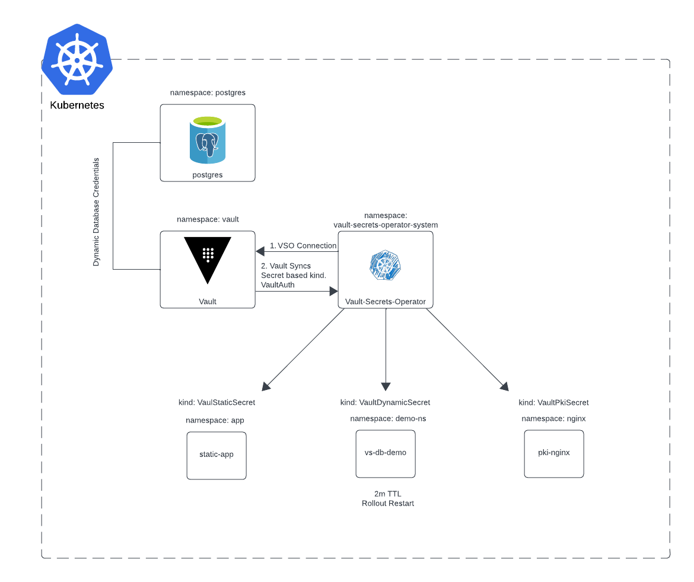

# Vault Secrets Operator Demo



This demo setup illustrates how to use the Vault Secrets Operator to provide secrets to three different applications.

## Prerequisites

Ensure the following prerequisites are met before starting the demo:

- A running Kubernetes cluster.
- Vault is installed and configured within your cluster.

## Applications

In this demo, we have three different applications accessing secrets:

1. **App 1 (secret-kv)**: Static App that retrieves secrets from Vault. Use this to demonstrate VSO behaviour.

2. **App 2 (nginx_tls_app)**: This is an NGINX application that retrieves a PKI certificate from Vault for HTTPS connection. Port 30443

3. **App 3 (vso-db-demo)**: Nginx Applications retrieves dynamic postgres credentials from Vault. Secrets rotate every 2mins. This can be adjusted. 

## Usage
This is purely to demonstrate the integration between Kubernetes and Vault. Please follow Kubernetes Best Bractices regarding RBAC for Service Accounts and storage encryption. 

To run this demo, follow these steps:

-  run ./01-setup-k8s.sh
- show secrets values base64 encoded in k8s
- show Vault Secrets Operator Logs 

## Show synced Secrets!


### 1. Static Secrets and do some changes in Vault
```
echo "password: $(kubectl get secret secretkv -n app -o jsonpath="{.data.password}" | base64 --decode)" > static-secret.yml
echo "username: $(kubectl get secret secretkv -n app -o jsonpath="{.data.username}" | base64 --decode)" >> static-secret.ym

`````

### 2. Dynamic Secrets.

```
export POSTGRES_PASSWORD=$(kubectl get secret vso-db-demo --namespace demo-ns -o jsonpath="{.data.password}" | base64 -d)

export POSTGRES_USERNAME=$(kubectl get secret vso-db-demo --namespace demo-ns -o jsonpath="{.data.username}" | base64 -d) 
```

#### Log in postgres
``` 
kubectl run postgres-postgresql-client --rm --tty -i --restart='Never' --namespace postgres --image docker.io/bitnami/postgresql:16.1.0-debian-11-r18 --env="PGPASSWORD=$POSTGRES_PASSWORD" \
--command -- psql --host postgres-postgresql -U $POSTGRES_USERNAME -d postgres -p 5432
```
#### Wait for two minutes and try to login again. Access should be denied. 


### 3. PKI Certs - self signed

```
kubectl get secret pki-tls -n nginx -o jsonpath="{.data['tls\.crt']}" | base64 --decode > tls-cert.crt
```

```
POD_NAME=$(kubectl get pods -n nginx -l app=nginx-tls-app -o jsonpath="{.items[0].metadata.name}")
```

```
kubectl exec -n nginx $POD_NAME -- cat /etc/nginx/ssl/tls.crt > pod-cert.crt
``` 

```
diff tls-cert.crt pod-cert.crt
```
- #### if there is no difference bettwen these two files, then certificate chain is succesfully synced. 
- #### download and mark it to always trust certificate
- #### visit https://localhost:30443

